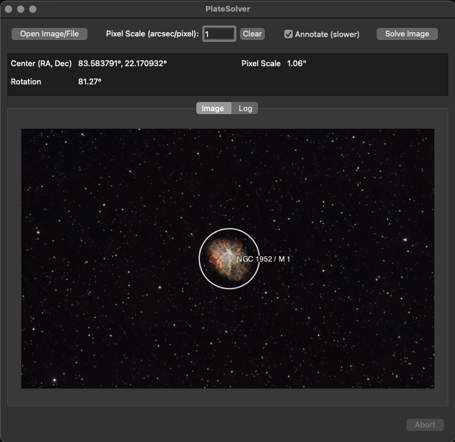

# PlateSolver

This app is just a small GUI frontend for a local astrometry.net install. It will allow you to placesolve an image and get basic info along with an annotated image. Handy for seeing the pixel resolution or the rotation.

## Requirements

You must have a local functional astrometry.net install. If it is working command line, this app should work as well. Follow the instructions for your platform to install and get it running.

## Usage

1. Select an image to solve
2. If you have a good idea of the pixel resolution, enter it. Otherwise leave it empty and the app will guess.
3. If you want the result annotated, check the box. It will take a little longer to solve. If you are just looking for rotation or resolution, don't bother.

## Packaging

You'll need pyinstaller to package this if you make changes

```sh
pyinstaller --onefile --windowed --name PlateSolver --icon icons/PsIcon.icns platesolver.py
```

To make a dmg image on Mac

```sh
hdiutil create -volname "PlateSolver" -srcfolder "PlateSolver.app" -ov -format UDZO "../installers/PlateSolver.dmg"
```


